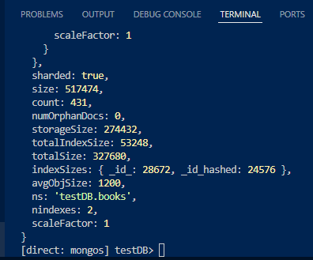

# ⚙️ Automated MongoDB Sharded Cluster Setup (Using Container Names)

I had wanted to set up a python script for this but it's much easier to just do this through 3 commands:  
Docker Compose and two `docker exec` commands that set up and populate our shards.

Lastly, you can do some manual queries that I noted at the bottom which show you if the structure is sharded or not, and also demonstrate that the data persists and gets sharded.

OBS:
To wipe and remove all instances of this container including its images and voumes (necessary if you want to rerun the setup without the old databases and data staying) then use this command:

```
docker compose down --volumes --rmi all
```
It removes all resources created by the compose project. Not any other containers, so it safely removes only this projects and associated files
---

## 🧰 The Setup

- Docker and Docker Compose containerize everything so it's clean and easy  
- Cluster runs via `docker compose up -d`  
- The `docker-compose.yml` in this folder already defines:
  - 3 Config Servers
  - 2 Shards
  - 1 Mongos Router  
- `scripts` folder:
  - `init-configsvr.js`
  - `init-shards.js`
  - `books.json`

---

## 📁 The Init Functions

The init functions inside the [`scripts`](./scripts/) folder are used to automate the shard creation and usage.

They will be used in the later steps to populate the created shard volumes with the names defined in the compose file and also set up the `mongos` router which handles all queries and chooses which shards to divide data to/from.

---

## 🧠 All You Have To Do Is Run These Commands

Of course we start with Docker Compose.  
Make sure you are in the [`mongoShards` folder.](../mongoShards/)  

```powershell
docker compose up -d
```

Now initialize the config servers:

```powershell
Get-Content .\scripts\init-configsvr.js | docker exec -i mongo-sharded-cluster-configsvr1-1 mongosh
```

- The above command executes the `init-configsvr.js` script inside the `mongo-sharded-cluster-configsvr1-1` container.  
  The config servers are predefined with a structure in the compose file that allows them to be routed easily by the `mongos` router.

## ⏳ Wait 10–20 seconds before running the next command, otherwise it might fail

```powershell
Get-Content .\scripts\init-shards.js | docker exec -i mongo-sharded-cluster-mongos-1 mongosh
```

- This script executes the `init-shards.js` inside the `mongos` container, which sets up the most crucial part — the `mongos` router.  
  It will handle all queries and funnel them to/from and between the shards.

---

## 📦 Importing `books.json` Into the Sharded Cluster

To test with real data instead of synthetic inserts, we use `books.json` from the `scripts` folder.

First, copy the file into the `mongos` container:

```powershell
docker cp .\scripts\books.json mongo-sharded-cluster-mongos-1:/tmp/books.json
```

Then, import it using the `mongoimport` tool **from PowerShell**, not inside the `mongosh` shell:

```powershell
docker exec mongo-sharded-cluster-mongos-1 mongoimport --db testDB --collection books --file /tmp/books.json
```

- ⚠️ Do **not** use `--jsonArray` since the file consists of newline-separated JSON objects, not a JSON array.

---

## 💡 Testing the Sharded Cluster

After the setup is complete and data is imported, you can test the cluster by connecting to the `mongos` container and performing some manual checks.

> ⚠️ Note: Docker consoles may not support `Ctrl+V` — use **right-click** to paste.

```powershell
docker exec -it mongo-sharded-cluster-mongos-1 mongosh
```

Once connected, run the following:

```js
use testDB;
db.books.countDocuments()
```

- This counts the number of documents imported from `books.json`.

```js
db.books.stats();
```

- This shows stats for the `books` collection, including whether it’s sharded and where data is located.

```js
...
  sharded: false,
  size: 517474,
  count: 431,
  numOrphanDocs: 0,
  storageSize: 274432,
  totalIndexSize: 53248,
  totalSize: 327680,
  indexSizes: { _id_: 28672, _id_hashed: 24576 },
  avgObjSize: 1200,
  ns: 'testDB.books',
  nindexes: 2,
  scaleFactor: 1
}
```

It will firstly show sharding to be false because we added it before shading the database. This is on purpose to show how mongos can both shard a database before adding data but also after. It will simply begin scattering it across shards and manage them all the same.

### Inside the mongosh instance with [direct: mongos]:
```
sh.enableSharding("testDB");
db.books.createIndex({ _id: "hashed" });
sh.shardCollection("testDB.books", { _id: "hashed" });
```
running these three commands will:
* Enable sharding for the database
* create an indexing so mongos can track entities by index across shards
* shard the collection on said indexes

Now we can see that running the `stats()` function will return that sharding is indeed true.



---

### ✅ Final Remarks

We have now created shards and used our `mongos` instance to funnel queries between/into different shards. The dataset "Books" was use from the provided github repository on the task, and successfully got sharded.  
This allows large data and traffic loads to be automatically distributed across multiple nodes, improving performance and scalability.

